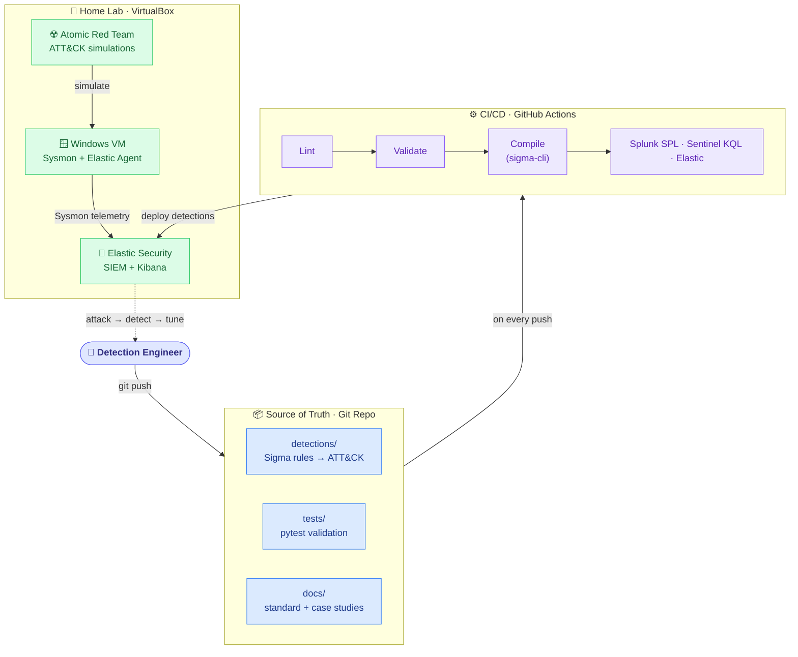

# PROJECT.md — Architecture & Key Decisions

This document records *what* the project is and *why* each major choice was made. It is updated at
every phase checkpoint.

## Mission

Build a polished, public **Detection-as-Code** portfolio project that demonstrates L2 /
detection-engineering skill, reproducible by a stranger from the README alone.

"Detection-as-Code" means treating detection rules like software: they live in version control,
follow a written standard, are automatically tested in CI, and are validated against real attacks —
instead of being hand-typed into a SIEM console and forgotten.

## Architecture (target end state)

## Key decisions

| Decision | Choice | Why |
|----------|--------|-----|
| Detection language | **Sigma** | Vendor-neutral; one rule compiles to many SIEMs; industry-standard for portable detections. |
| Rule conversion | **sigma-cli / pySigma** | Official Sigma tooling; supports Splunk, Elastic, Sentinel backends. |
| Lab SIEM | **Elastic Security (single-node, Docker)** | Free, widely used in job postings, full Sysmon integration. Chosen over Elastic Cloud trial (expires, not reproducible long-term) and Wazuh (lighter but less common in postings). |
| Hypervisor | **VirtualBox** | Already installed; free; Windows 11 Home has no native Hyper-V. |
| Endpoint telemetry | **Sysmon (SwiftOnSecurity config) + Elastic Agent** | SwiftOnSecurity config is a well-known, community-vetted baseline that cuts noise. |
| Attack simulation | **Atomic Red Team** | Per-technique atomic tests map cleanly 1:1 to ATT&CK; ideal for attack→detect→tune. |
| CI/CD | **GitHub Actions** | Native to GitHub, free for public repos, green-badge visibility for recruiters. |
| Scope | **Detection engineering only** | Deliberately laser-focused on authoring, testing, validating, and shipping detections. SOC automation (phishing/IOC triage) was descoped to keep the repo's story sharp — it belongs in a separate project. |

## Environment notes

- Dev machine: Windows 11 Home. Git 2.55.0, Python 3.14.5 installed.
- Python 3.14 is *newer* than the 3.11+ target — watch for pySigma backend install issues; fallback
  is a side-by-side Python 3.11/3.12 install (does not require rewriting anything).
- Docker Desktop 4.80 installed (WSL2 backend) in Phase 1.
- Windows VM `DaC-Win10-Endpoint` (Win10 Enterprise x64, 4 GB/2 CPU) built in VirtualBox in Phase 1.

## Phase 1 lab notes (key decisions & gotchas)

- **Stack runs HTTP + auth, TLS OFF.** Elastic 8's preconfigured Fleet outputs reject `config_yaml`
  / `verification_mode`, and the only schema-valid trust option (`ca_trusted_fingerprint`) is
  regenerated per install → not reproducible. Turning off HTTP TLS (keeping password auth) removed
  all cert/SAN headaches and is fully reproducible. Production would re-enable TLS.
- **Fleet preconfiguration lives in `lab/kibana.yml`**, not env vars — Kibana won't parse complex
  arrays (outputs/policies) from environment variables (`.find is not a function` crash).
- **Fleet Server must bind `0.0.0.0`** (`FLEET_SERVER_HOST=0.0.0.0`); it defaults to `localhost`
  inside the container, which Docker port-publishing can't reach. Changing it requires wiping the
  `fleetserverdata` volume so it re-bootstraps.
- **Agents enrol with `--insecure`** because Fleet Server is HTTP in the lab.
- All host-facing services on the VirtualBox host-only IP `192.168.56.1` (:9200 ES, :5601 Kibana,
  :8220 Fleet). The VM sits on `192.168.56.101`.

## Detection standard

Every rule must conform to [`docs/detection-standard.md`](docs/detection-standard.md). CI enforces
the required-field subset automatically from Phase 4 onward.
