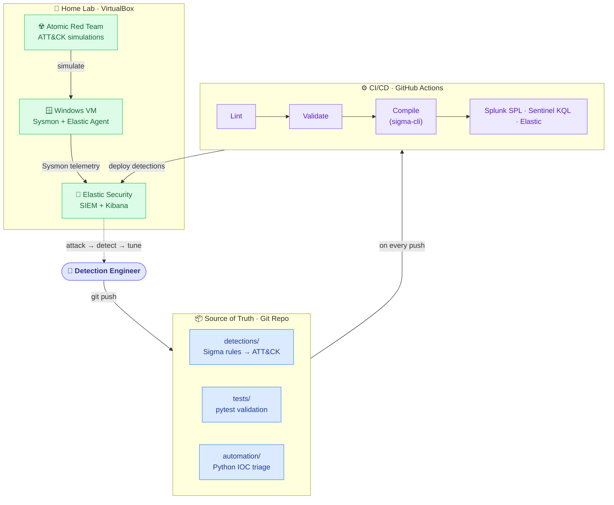

# Detection-as-Code

A public, reproducible **Detection-as-Code** portfolio project: version-controlled
[Sigma](https://github.com/SigmaHQ/sigma) detection rules mapped to
[MITRE ATT&CK](https://attack.mitre.org/), validated in a real home lab with
[Atomic Red Team](https://github.com/redcanaryco/atomic-red-team), and shipped through a
CI/CD pipeline — the same way modern detection engineering teams manage detections in production.

> **Status:** 🚧 Under active construction. Built in public, one phase at a time.

---

## Architecture



## What this project demonstrates

**Built so far:**
- **Detection engineering** — 12 [Sigma](https://github.com/SigmaHQ/sigma) rules across
  7 ATT&CK tactics, each with full metadata and auto-compiled to Splunk SPL, Elastic, and
  Microsoft Sentinel (KQL) — 36 queries total, all passing lint validation.
- **A reproducible home lab** — a Windows VM running Sysmon (SwiftOnSecurity config),
  shipping live telemetry into Elastic Security via Elastic Agent.
- **Purple-team validation** — the *attack → detect → tune* loop driven by
  [Atomic Red Team](https://github.com/redcanaryco/atomic-red-team), with documented
  case studies showing real false-positive tuning (see below).

**Planned (see roadmap):**
- **CI/CD for detections** — a GitHub Actions pipeline to lint, validate, and test-compile
  every rule on each push *(Phase 4)*.
- **ATT&CK coverage visibility** — an auto-generated MITRE ATT&CK Navigator layer *(Phase 4)*.
- **Security automation** — a Python phishing / IOC triage tool with API enrichment *(Phase 5)*.


## Project status

Built in public, one phase at a time. Detailed log in [`PROGRESS.md`](PROGRESS.md).

| Phase | Focus | Status |
|-------|-------|--------|
| 0 | Repo scaffold & detection standards | ✅ Done |
| 1 | Home lab — telemetry flowing to Elastic | ✅ Done |
| 2 | Write the detections (12 Sigma rules, 7 tactics) | ✅ Done |
| 3 | Attack → detect → tune with Atomic Red Team | 🚧 In progress |
| 4 | CI/CD pipeline & ATT&CK Navigator coverage map | ⬜ Planned |
| 5 | Python phishing / IOC triage tool | ⬜ Planned |
| 6 | Polish & publish | ⬜ Planned |

## Featured case studies

Each writeup follows the same loop: **simulate the technique → confirm the detection fires →
tune out false positives**. Screenshots included.

| Technique | ATT&CK ID | What it shows |
|-----------|-----------|---------------|
| [PowerShell encoded command](docs/case-studies/T1059.001-powershell-encoded-command.md) | T1059.001 | An Elastic case-sensitivity gap made the rule miss the attack — diagnosed and hardened to catch it |
| [LSASS memory access](docs/case-studies/T1003.001-lsass-memory-access.md) | T1003.001 | Fixed a missing-telemetry gap (Sysmon EID 10), then tuned out agent false positives and a missed access mask |
| [New service install](docs/case-studies/T1543.003-new-service-install.md) | T1543.003 | A rule-scope tradeoff — catches shell-based services (PsExec/Cobalt Strike), skips arbitrary binaries |
| [Failed-logon brute force](docs/case-studies/T1110-failed-logon-bruteforce.md) | T1110 | Correlating failed-logon bursts into a brute-force alert |
| [Mshta execution](docs/case-studies/T1218.005-mshta.md) | T1218.005 | Spotting `mshta.exe` LOLBin abuse |
| [Renamed system binary](docs/case-studies/T1036.003-renamed-system-binary.md) | T1036.003 | Flagging masquerading via renamed system binaries |

## Repository layout

```
detection-as-code/
├── detections/            # Sigma rules, organized by ATT&CK tactic
├── tests/                 # pytest suite that validates every rule against the standard
├── automation/            # Python phishing / IOC triage tool
├── lab/                   # Home-lab setup (Docker Compose, agent configs, lab README)
├── docs/                  # Detection standard, case studies, coverage map, screenshots
│   ├── case-studies/      # One attack→detect→tune writeup per technique
│   ├── reports/           # Generated triage reports (gitignored)
│   └── screenshots/       # Evidence screenshots
└── .github/workflows/     # CI/CD pipeline
```

## Tech stack

| Area | Tool |
|------|------|
| Detection language | Sigma (converted via `sigma-cli` / pySigma) |
| Lab SIEM | Elastic Security (single-node, Docker) |
| Endpoint telemetry | Windows VM + Sysmon (SwiftOnSecurity config) + Elastic Agent |
| Attack simulation | Atomic Red Team |
| CI/CD | GitHub Actions |
| Automation | Python 3.11+ (standard library + `requests`) |

## Quickstart

> Full setup instructions arrive as each phase lands. See [`PROGRESS.md`](PROGRESS.md) for current
> status and [`PROJECT.md`](PROJECT.md) for architecture and design decisions.

## License

[MIT](LICENSE) © ijaz-aj
