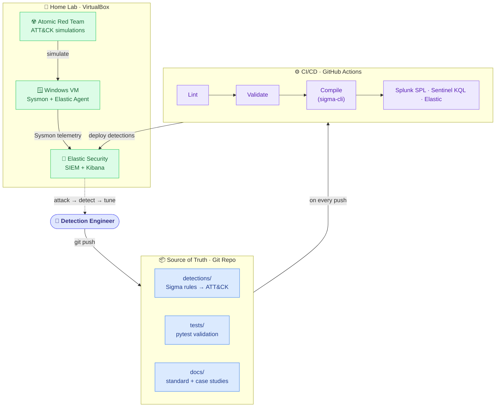
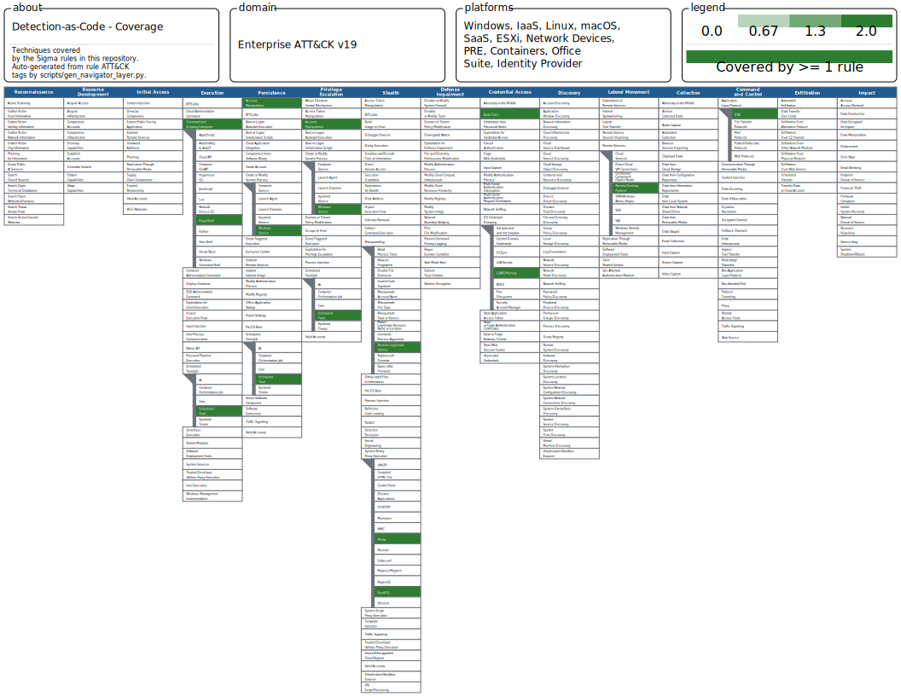

# Detection-as-Code

[](https://github.com/ijaz-aj/detection-as-code/actions/workflows/validate.yml)

A public, reproducible **Detection-as-Code** portfolio project: version-controlled
[Sigma](https://github.com/SigmaHQ/sigma) detection rules mapped to
[MITRE ATT&CK](https://attack.mitre.org/), validated in a real home lab with
[Atomic Red Team](https://github.com/redcanaryco/atomic-red-team), and shipped through a
CI/CD pipeline — the same way modern detection engineering teams manage detections in production.

> **Status:** Core complete — 12 rules, home-lab validation, a CI pipeline, and an ATT&CK coverage
> map are all live (Phases 0–4). Final polish in progress. Built in public, one phase at a time.

---

## Architecture



> *Target architecture. Today, CI lints, validates, and compiles every rule on each push (the badge
> above), and detections are validated by hand against Atomic Red Team in the lab. The automated
> CI → SIEM deployment arrow is the production end-state, not yet wired in this lab build.*

## What this project demonstrates

- **Detection engineering** — 12 [Sigma](https://github.com/SigmaHQ/sigma) rules across
  7 ATT&CK tactics, each with full metadata and auto-compiled to Splunk SPL, Elastic, and
  Microsoft Sentinel (KQL) — 36 queries total, all passing lint validation.
- **A reproducible home lab** — a Windows VM running Sysmon (SwiftOnSecurity config),
  shipping live telemetry into Elastic Security via Elastic Agent.
- **Purple-team validation** — the *attack → detect → tune* loop driven by
  [Atomic Red Team](https://github.com/redcanaryco/atomic-red-team), with 8 documented case
  studies showing real sensor gaps, index-mapping fixes, and false-positive tuning (see below).
- **CI/CD for detections** — a [GitHub Actions pipeline](.github/workflows/validate.yml) that
  lints, validates, and test-compiles every rule on each push (green badge above).
- **ATT&CK coverage visibility** — an auto-generated MITRE ATT&CK Navigator heatmap, built from
  the rules' own tags (below).


## Project status

Built in public, one phase at a time. Detailed log in [`PROGRESS.md`](PROGRESS.md).

| Phase | Focus | Status |
|-------|-------|--------|
| 0 | Repo scaffold & detection standards | ✅ Done |
| 1 | Home lab — telemetry flowing to Elastic | ✅ Done |
| 2 | Write the detections (12 Sigma rules, 7 tactics) | ✅ Done |
| 3 | Attack → detect → tune with Atomic Red Team (8 case studies) | ✅ Done |
| 4 | CI/CD pipeline & ATT&CK Navigator coverage map | ✅ Done |
| 5 | Polish & publish | 🚧 In progress |

## Featured case studies

Each writeup follows the same loop: **simulate the technique → confirm the detection fires →
diagnose and fix any gaps** (rule logic, sensor, or index mapping). Screenshots included.

| Technique | ATT&CK ID | What it shows |
|-----------|-----------|---------------|
| [PowerShell encoded command](docs/case-studies/T1059.001-powershell-encoded-command.md) | T1059.001 | An Elastic case-sensitivity gap made the rule miss the attack — diagnosed and hardened to catch it |
| [LSASS memory access](docs/case-studies/T1003.001-lsass-memory-access.md) | T1003.001 | Fixed a missing-telemetry gap (Sysmon EID 10), then tuned out agent false positives and a missed access mask |
| [Scheduled task creation](docs/case-studies/T1053.005-scheduled-task-creation.md) | T1053.005 | Two silent failures in two layers — a Windows audit-policy sensor gap, then an Elastic index-mapping gap (`_ignored`) — both fixed without touching the rule |
| [New service install](docs/case-studies/T1543.003-new-service-install.md) | T1543.003 | A rule-scope tradeoff — catches shell-based services (PsExec/Cobalt Strike), skips arbitrary binaries |
| [Failed-logon brute force](docs/case-studies/T1110-failed-logon-bruteforce.md) | T1110 | Correlating failed-logon bursts into a brute-force alert |
| [Mshta execution](docs/case-studies/T1218.005-mshta.md) | T1218.005 | Spotting `mshta.exe` LOLBin abuse |
| [Renamed system binary](docs/case-studies/T1036.003-renamed-system-binary.md) | T1036.003 | Flagging masquerading via renamed system binaries |
| [User added to admins](docs/case-studies/T1098-user-added-to-admins.md) | T1098 | A clean SID-based catch — flags adds to Administrators, ignores the benign Users add |

## ATT&CK coverage

The rules span **12 techniques across 7 ATT&CK tactics**. This heatmap is **auto-generated from the
rules' own ATT&CK tags** by [`scripts/gen_navigator_layer.py`](scripts/gen_navigator_layer.py), so the
coverage map can never drift from the actual detections.



Explore it interactively: load [`coverage-layer.json`](docs/attack-navigator/coverage-layer.json) into the
[MITRE ATT&CK Navigator](https://mitre-attack.github.io/attack-navigator/) via **Open Existing Layer →
Upload from local**. Regenerate after adding or retagging rules with:

```bash
python scripts/gen_navigator_layer.py
```

## Repository layout

```
detection-as-code/
├── detections/            # Sigma rules, organized by ATT&CK tactic
├── tests/                 # pytest suite that validates every rule against the standard
├── scripts/               # Utility scripts (ATT&CK Navigator layer generator)
├── lab/                   # Home-lab setup (Docker Compose, agent configs, lab README)
├── docs/                  # Detection standard, case studies, coverage map, screenshots
│   ├── attack-navigator/  # Auto-generated ATT&CK coverage layer (JSON) + heatmap (SVG)
│   ├── case-studies/      # One attack→detect→tune writeup per technique
│   └── screenshots/       # Evidence screenshots
└── .github/workflows/     # CI/CD pipeline
```

## Tech stack

| Area | Tool |
|------|------|
| Detection language | Sigma (converted via `sigma-cli` / pySigma) |
| Lab SIEM | Elastic Security (single-node, Docker) |
| Endpoint telemetry | Windows VM + Sysmon (SwiftOnSecurity config) + Elastic Agent |
| Attack simulation | Atomic Red Team |
| Validation / CI | pytest · GitHub Actions |

## Quickstart

**Validate and compile the rules** (host machine, ~2 min — no lab required):

```bash
git clone https://github.com/ijaz-aj/detection-as-code.git
cd detection-as-code
python -m venv venv && source venv/Scripts/activate    # macOS/Linux: source venv/bin/activate
pip install -r requirements.txt

pytest -v                                              # validate every rule against the standard
sigma check -x attacktag detections/                  # lint — confirm valid Sigma
sigma convert -t splunk -p splunk_windows detections/ # compile to Splunk SPL
python scripts/gen_navigator_layer.py                 # regenerate the ATT&CK coverage layer
```

(Elastic and Sentinel use rule-specific pipelines — see [`PROGRESS.md`](PROGRESS.md) Phase 2 for the exact
conversion commands per backend.)

**Stand up the home lab** (Windows VM + Sysmon → Elastic Security): follow [`lab/README.md`](lab/README.md).

Architecture and design decisions live in [`PROJECT.md`](PROJECT.md); the full build log is in
[`PROGRESS.md`](PROGRESS.md).

## Roadmap

The core is complete. Natural next steps toward a production-grade system:

- **Broaden coverage** — add rules for the highest-frequency techniques in the target environment.
- **Automated deployment** — push validated rules straight into Elastic detection rules, closing the
  `CI → SIEM` loop from the architecture diagram.
- **CI-generated coverage map** — regenerate the ATT&CK Navigator layer inside CI so it is guaranteed
  current on every push.
- **Threat-intel enrichment** — indicator-match rules driven by an IOC feed.

## License

[MIT](LICENSE) © ijaz-aj
