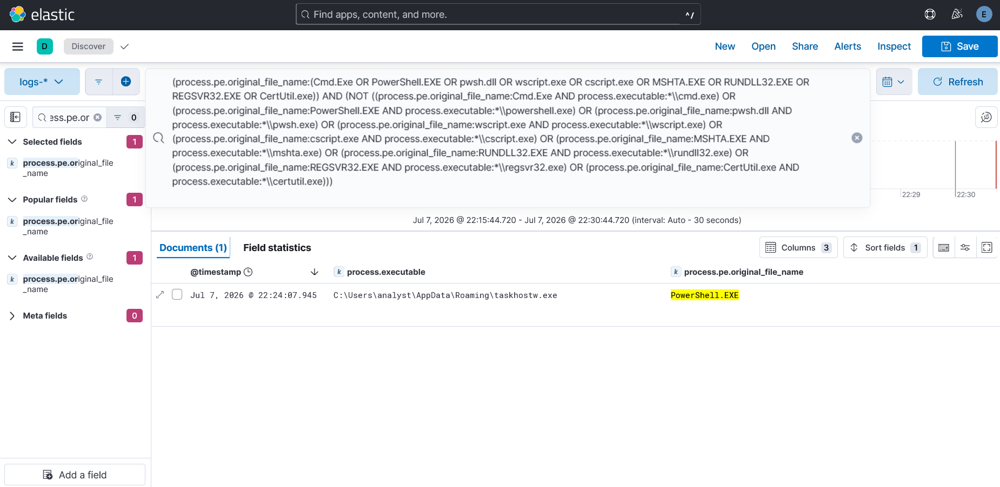

# Case Study — T1036.003 Renamed System Binary (Masquerading)

**Rule:** [`renamed-system-binary`](../../detections/defense-evasion/renamed-system-binary/)
**Tactic / Technique:** Defense Evasion / T1036.003
**Date:** 2026-07-07

> A clean catch that shows an elegant detection idea: an attacker can rename the *file*, but not the
> identity baked into the binary's PE metadata.

## 1. Attack (Atomic Red Team)

```powershell
Invoke-AtomicTest T1036.003 -TestNumbers 5   # powershell.exe running as taskhostw.exe
```
```
copy %windir%\System32\windowspowershell\v1.0\powershell.exe %APPDATA%\taskhostw.exe /Y
cmd.exe /K %APPDATA%\taskhostw.exe
```
Copies `powershell.exe` to `%APPDATA%\taskhostw.exe` and runs it — masquerading as a benign Windows
process, from a non-standard (user-writable) path. Name-based detection that looks for
`powershell.exe` would miss it entirely.

*(The ART harness reported a 120s timeout — harmless: `cmd /K` keeps the window open. The copy
succeeded and the renamed binary ran, so Sysmon EID 1 fired.)*

## 2. Why OriginalFileName is the tell

When you rename a PE file on disk, its embedded **`OriginalFileName`** (in the version metadata) does
**not** change. Sysmon Event ID 1 logs both:
- `Image` = the on-disk name (attacker-controlled) → `...\taskhostw.exe`
- `OriginalFileName` = the real identity (baked in) → `PowerShell.EXE`

A **mismatch** between them is the masquerade.

## 3. Detect — clean catch (and the elegant part)

Pasting Rule 11's Lucene query returned **exactly one** event:

| process.executable | process.pe.original_file_name |
|--------------------|-------------------------------|
| `C:\Users\analyst\AppData\Roaming\taskhostw.exe` | `PowerShell.EXE` |

The renamed PowerShell caught. **Crucially, the *real* `powershell.exe` that also ran during the test
is NOT in the results.** Rule 11's logic (`OriginalFileName` in a known list **AND NOT** the matching
legit `Image`) fires on the *lie* and ignores the legitimate process where the names agree. That's the
difference between "flag all PowerShell" (noise) and "flag PowerShell **masquerading**" (signal).

## 4. Known limitation (scope)

Rule 11 matches a curated list of `OriginalFileName` values (`Cmd.Exe`, `PowerShell.EXE`, `pwsh.dll`,
`wscript.exe`, `cscript.exe`, `MSHTA.EXE`, `RUNDLL32.EXE`, `REGSVR32.EXE`, `CertUtil.exe`). A renamed
binary whose original name is **not** in that list (e.g. atomic test #6, "non-windows exe running as
windows exe") would be missed. A more general approach compares `Image` vs `OriginalFileName`
directly, but field-to-field comparison doesn't port to Elastic Lucene — so the curated-list approach
is the portable tradeoff (see the tuning note in the rule).

## Screenshots
Rule 11's Lucene query returning only the masquerade — `taskhostw.exe` with `OriginalFileName =
PowerShell.EXE`, while the legitimate `powershell.exe` is correctly excluded.


