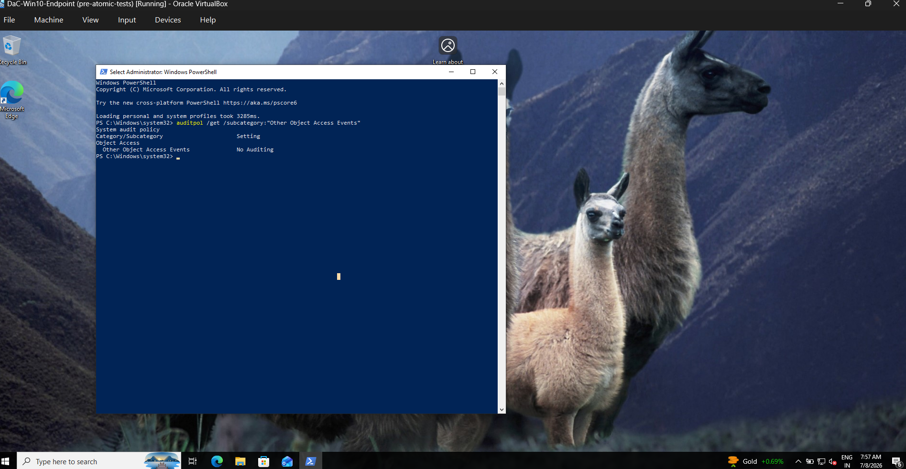
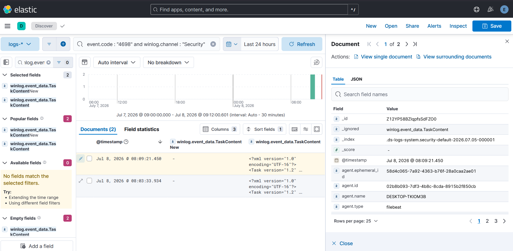
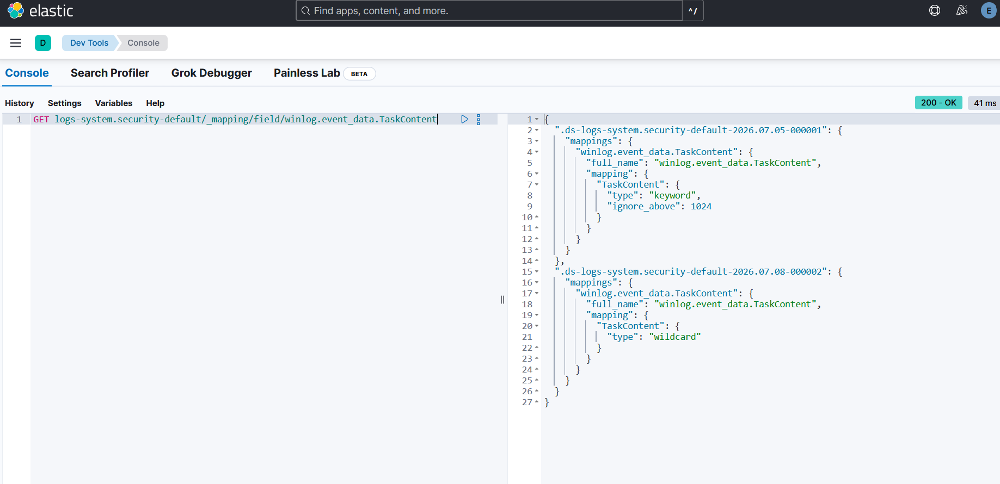
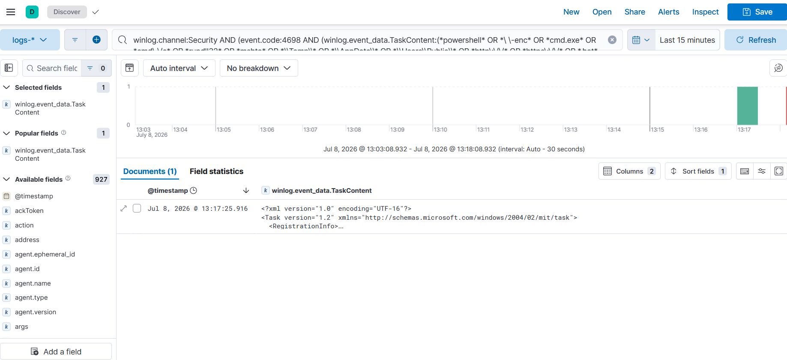

# Case Study — T1053.005 Scheduled Task Creation

**Rule:** [`scheduled-task-creation`](../../detections/persistence/scheduled-task-creation/)
**Tactic / Technique:** Persistence + Execution / T1053.005
**Date:** 2026-07-08

> The deepest loop of the project. We tried to detect a malicious scheduled task and the detection
> failed **twice, for two completely different reasons** — first the evidence was never recorded, then
> the evidence *was* recorded but couldn't be searched. Neither failure was in the rule. We fixed each
> at its own layer (Windows audit policy, then the Elastic index mapping) and the original, unchanged
> rule then caught the attack cleanly.

---

## 1. Why attackers do this

A **scheduled task** is one of the most reliable persistence mechanisms on Windows. Once created, it
**runs automatically** on a trigger — at logon, at boot, on a timer — and can be configured to run as
**SYSTEM**, the highest-privileged account. That combination (survives reboots + runs as SYSTEM) is
exactly what an attacker wants for a durable foothold, which is why scheduled-task abuse (MITRE
**T1053.005**) shows up across commodity malware and named intrusion sets alike (e.g. TinyTurla, many
ransomware crews). Windows records task creation as **Security Event ID 4698** ("a scheduled task was
created") — *if* the right auditing is switched on.

## 2. Simulate (Atomic Red Team)

```powershell
Invoke-AtomicTest T1053.005 -TestNumbers 2   # "Scheduled task Local"
```
```
SCHTASKS /Create /SC ONCE /TN spawn /TR C:\windows\system32\cmd.exe /ST 20:10
```
Creates a task named `spawn` whose action is `cmd.exe`. The **4698 event fires on creation** — we do
not need the task to actually run at 20:10. A task that launches a shell (`cmd.exe`) from the Task
Scheduler is precisely the high-signal pattern Rule 6 is built to flag.

## 3. Detect — the mental model: a detection has three layers

Before the findings, the frame that makes them make sense. For **any** rule to fire, evidence must
survive a journey through three layers — like a CCTV system:

| Layer | Question | If it fails |
|-------|----------|-------------|
| **1. Sensor** | Did Windows *record* the event? | Nothing shows up at all |
| **2. Pipeline** | Did the agent *ship* it to Elastic? | Nothing shows up at all |
| **3. Index** | Did Elasticsearch *store it searchably*? | Data is **visible** but the rule silently misses |
| **→ Rule** | Is the detection logic correct? | Data present & searchable, rule needs tuning |

This one attack failed at **layer 1 first**, and after we fixed that, at **layer 3**. The rule logic
was correct the entire time.

## 4. Finding #1 — Sensor gap: the event was never recorded

Before attacking, we checked whether Windows was even auditing task creation:

```powershell
auditpol /get /subcategory:"Other Object Access Events"
```
```
Other Object Access Events              No Auditing
```

**`No Auditing` = the camera is off.** Event 4698 lives under the *Other Object Access Events* audit
subcategory, which Windows ships **disabled by default**. So no 4698 was being written — the rule was
structurally blind, and no rule change could have helped.

**Fix (sensor layer):**
```powershell
auditpol /set /subcategory:"Other Object Access Events" /success:enable
```
(`/success` only — a task *creation* is a successful object-access event; `/failure` would just add
noise.) After enabling, we re-ran the attack and confirmed the `spawn` 4698 landed in Elastic.

> **Real-world note:** the moment you enable this policy, Windows' own routine task creation starts
> logging too (e.g. `\Microsoft\Windows\UpdateOrchestrator\MusUx_LogonUpdateResults`). That benign
> noise is exactly why the rule is **scoped** to shell/script/temp patterns rather than alerting on
> every 4698.



## 5. Finding #2 — Index gap: recorded, visible… but not searchable

Now the event existed and was **clearly visible** in Discover — we could read the full task XML in the
`TaskContent` field. Yet pasting Rule 6's query returned **"No results."** The event is right there,
but the rule can't find it.

The tell was one line in the document: **`_ignored: winlog.event_data.TaskContent`.**

What that means, plainly:
- The task definition (the XML containing `cmd.exe`) is stored in the field `TaskContent`.
- Elasticsearch had `TaskContent` mapped as type **`keyword`**, which has a hard length limit —
  **`ignore_above: 1024`** characters.
- The task XML is far longer than 1024 characters.
- So Elasticsearch **kept the value** (you can read it) but **refused to index it** — making it
  **unsearchable** — and noted the field in the document's `_ignored` list.

**Analogy:** the footage was recorded and sitting in a drawer, but it was never added to the searchable
catalog. Look at it by hand — fine. Ask the computer to *find* it — nothing.

This is the deceptive failure mode: at **layer 3**, the data *looks perfectly present*, so the rule
appears broken when the real problem is the storage mapping.

```
event.code:"4698" and winlog.event_data.TaskContent:*cmd.exe*   -> 0 results  (field not indexed)
event.code:"4698" and message:"cmd.exe"                         -> 1 result   (message IS searchable)
```
The `message` probe proved the content was captured and matchable *somewhere* — just not in the
`keyword` field the rule targets.



## 6. Fix — remap the field to `wildcard` (index layer)

The correct field type here is **`wildcard`**: no length limit, and purpose-built for `*substring*`
searches inside long strings (it also handles the *leading* wildcard in `*cmd.exe*` efficiently, which
`keyword` does not). Two Elasticsearch rules shaped *how* to apply it:

1. **You cannot change a field's type on an existing index** — the type is frozen at index creation.
   So the change must apply to *new* data.
2. **Fleet integrations reserve a `@custom` override slot.** The managed index template for
   `logs-system.security` is assembled from stacked component templates and leaves an empty block named
   `logs-system.security@custom` at the **end** — the sanctioned place for user overrides. Because it
   stacks **last**, it wins; because you never edit Fleet's own blocks, the override **survives
   integration upgrades**.

**Step 1 — add the override (Kibana → Dev Tools):**
```json
PUT _component_template/logs-system.security@custom
{
  "template": { "mappings": { "properties": { "winlog": { "properties": {
    "event_data": { "properties": { "TaskContent": { "type": "wildcard" } } }
  } } } } }
}
```

**Step 2 — roll over the data stream** so a fresh backing index is born using the updated recipe:
```
POST logs-system.security-default/_rollover      ->  "rolled_over": true, new_index ...-000002
```

**Step 3 — verify the new mapping took:**
```
GET logs-system.security-default/_mapping/field/winlog.event_data.TaskContent
```
| Backing index | TaskContent type |
|---------------|------------------|
| `...-000001` (old) | `keyword`, `ignore_above: 1024`  ← the root cause, in black and white |
| `...-000002` (new) | `wildcard`  ← the fix |



## 7. Verify — same rule, now it catches

New events land in `-000002` (wildcard), so we re-ran the attack for a fresh 4698, then pasted Rule 6's
**original, unchanged** Lucene query:

| | Result |
|---|---|
| **Before (old mapping)** | 0 hits — `TaskContent` unsearchable (`_ignored`) |
| **After (wildcard + rollover)** | **1 hit — the `spawn` task**, matched on `*cmd.exe*` |

The benign Windows Update task (`MusNotification.exe`) is correctly **not** matched — precision holds.
**Zero changes to the rule or its query.** The entire fix lived at the index-mapping layer.



## 8. Cross-SIEM note

This was an **Elastic-specific** problem (like the T1059.001 case-sensitivity finding). Splunk indexes
the raw event and would search the task content directly; the Sentinel schema stores it differently.
Neither hits the `keyword`/`ignore_above` limit — so the same Sigma rule behaves differently per
backend, and portability includes the *storage* layer, not just the query syntax.

## 9. Key takeaway

> When a rule doesn't fire, don't just re-read the rule. Walk the evidence **backwards through all
> three layers — sensor, index, logic** — because the failure can hide in any of them. The
> **index-layer** failure is the most deceptive: the data looks perfectly present in the SIEM, yet a
> correct rule silently misses because the field was never made searchable.

This technique alone demonstrates all three detection-failure archetypes seen across the project:

| Layer | Example | Symptom |
|-------|---------|---------|
| **Sensor** | LSASS EID 10 off; **4698 audit policy off** | Nothing recorded |
| **Index** | **T1053.005 `TaskContent` `_ignored`** | Visible but unsearchable |
| **Rule logic** | T1059.001 Elastic case-sensitivity | Present, rule needs tuning |
