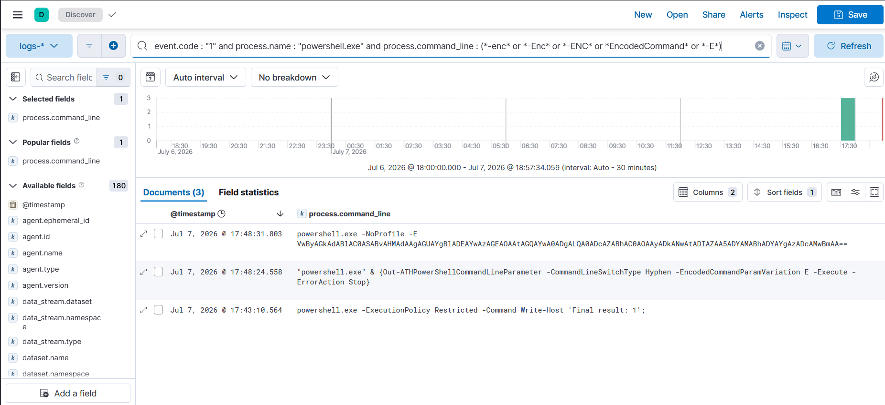
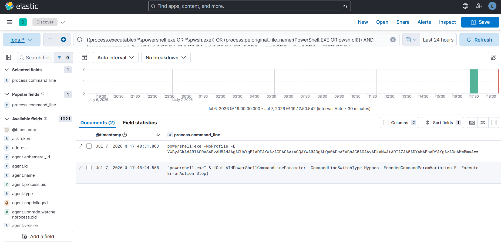

# Case Study — T1059.001 PowerShell Encoded Command

**Rule:** [`powershell-encoded-command`](../../detections/execution/powershell-encoded-command/)
**Tactic / Technique:** Execution / T1059.001
**Date:** 2026-07-06

## 1. Attack (Atomic Red Team)

```powershell
Invoke-AtomicTest T1059.001 -TestNumbers 15   # ATH -EncodedCommand parameter variations
```
The test launched PowerShell with the **`-E`** (uppercase) abbreviation of `-EncodedCommand`:
```
powershell.exe -NoProfile -E VwByAGkAdABlAC0ASABvAHMAdAAg...   (pid 8008)
```

## 2. Detect — initial result: MISS ❌

Querying live Elasticsearch (`logs-windows.sysmon_operational-*`, last 45m):

| Query | Hits |
|-------|------|
| Control (find event by its base64) | 1 (event landed fine) |
| **Rule 1 as originally written** | **0 (missed the attack)** |
| Same logic but case-insensitive | 3 (event is matchable) |

## 3. Diagnosis

The atomic used **`-E` (uppercase)**. The original rule matched `-e` / `-enc` / `-ec` (lowercase).
Sigma rules are *specified* to be case-insensitive, but that intent **did not survive translation to
the Elastic Lucene backend** — Lucene matches the `process.command_line` keyword field
**case-sensitively**, so `-e` never matched `-E`.

**Cross-SIEM nuance:** Kusto's `contains` and Splunk's matching are case-insensitive, so the
**Sentinel and Splunk** versions of the same rule would have caught this attack. The gap was
**Elastic-specific**. One Sigma rule can behave differently across SIEMs.

*(A `|re|i` case-insensitive regex was tested as a fix: it converts cleanly for Splunk and Sentinel,
but the pySigma Elasticsearch backend does not support the regex modifier at all — Lucene or EQL —
so regex was a dead end for the very backend that needed it.)*

## 4. Tune

Two-part fix:
1. **Rule hardening (applied):** enumerate the common case/abbreviation variants of the encoded flag
   (`-e`, `-E`, `-ec`, `-EC`, `-enc`, `-Enc`, `-ENC`, `-EncodedCommand`, `-encodedcommand`) so
   `contains` matches even on case-sensitive Elastic Lucene.
2. **Ideal production fix (documented):** on Elastic, use a lowercased / case-insensitive
   command-line field so *any* casing is caught without enumeration. Splunk/Sentinel need no change.

## 5. Verify — tuned result: CATCH ✅

Re-running the **tuned** rule's Elastic query against live data:
```
TUNED Rule 1 hits: 2   (includes pid 8008 — the attack)
```

## 6. Residual / further tuning
- The broad `-Enc*` match also matches the AtomicTestHarnesses parameter
  `-EncodedCommandParamVariation` (a test artifact, not seen in real attacks). Acceptable here; in a
  high-volume environment, refine by requiring the flag be followed by a base64-looking argument.

## Screenshots

**Broad hunt — noisy (`*-E*` in KQL):** catches the attack (pid 8008) but also a benign
`-ExecutionPolicy` command — a false positive from the unbounded substring match.



**Hardened rule (Lucene, space-bounded `-E`) — clean:** catches pid 8008 with no false positive.


