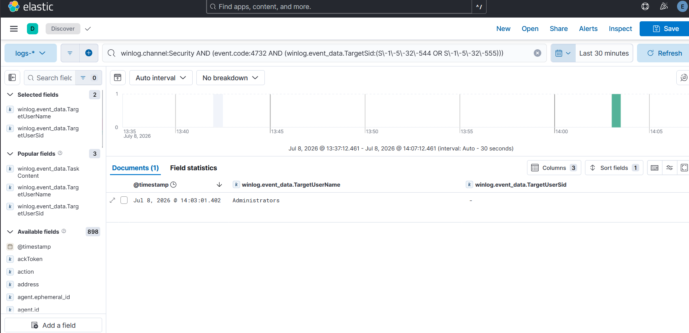

# Case Study — T1098 User Added to Privileged Group

**Rule:** [`user-added-to-admins`](../../detections/persistence/user-added-to-admins/)
**Tactic / Technique:** Persistence + Privilege Escalation / T1098
**Date:** 2026-07-08

> A clean, high-fidelity catch. An account added to **local Administrators** fires Security Event 4732,
> and the rule matches it by **group SID** (`S-1-5-32-544`) rather than the name "Administrators" — so
> it's locale-independent and can't be dodged by a renamed or translated group. It caught the
> privileged add and correctly ignored the benign one, no tuning required.

---

## 1. Why attackers do this

Adding an account to the **local Administrators** group is one of the simplest and most durable ways to
keep privileged access on a host. Once an attacker has admin rights they'll often create (or co-opt) an
account and drop it into Administrators, so that even if their malware is cleaned up, a
fully-privileged **login** remains. It frequently follows account creation (T1136) and is a textbook
**persistence + privilege-escalation** move (MITRE **T1098**). Windows records the group-membership
change as **Security Event ID 4732** ("a member was added to a security-enabled local group").

## 2. Simulate — and a lesson in matching the test to the telemetry

The obvious atomic, **T1098 Test 1 "Admin Account Manipulate,"** turned out to be the *wrong* tool —
checking it first with `-ShowDetails` showed it **renames** the built-in Administrator account
(`Rename-LocalUser`) rather than adding anyone to a group:

```powershell
Invoke-AtomicTest T1098 -TestNumbers 1 -ShowDetails   # renames Administrator → fires 4781, NOT 4732
```

That's a *masking* action (Event 4781, account renamed) — it never produces the 4732 our rule keys on.
The label "T1098" spans many distinct actions; **only some generate the event a given rule detects.**
So we used a clean, controlled command that produces the exact telemetry — create a throwaway account
and add it to Administrators:

```powershell
net user dac_test 'P@ssw0rd-Dac1' /add          # creates the account (auto-adds to "Users")
net localgroup administrators dac_test /add      # → fires 4732 for group Administrators (S-1-5-32-544)
```
*(Reverted afterward with `net localgroup administrators dac_test /delete` + `net user dac_test /delete`.)*

## 3. Sensor check — no gap this time

Unlike the LSASS (Sysmon EID 10) and scheduled-task (audit policy) cases, the sensor was already on:
```powershell
auditpol /get /subcategory:"Security Group Management"   ->   Success
```
Windows audits **Security Group Management** by default, so 4732 flows without any change. Verifying it
anyway is the discipline — you confirm the telemetry exists *before* trusting a "no results" query.

## 4. Detect — clean catch, and why the SID matters

Two 4732 events were produced by the test:

| Time | Group added to | Group SID | Rule 8 |
|------|----------------|-----------|--------|
| 14:01:46 | **Users** | `S-1-5-32-545` | ❌ ignored (not privileged) |
| 14:03:01 | **Administrators** | `S-1-5-32-544` | ✅ **caught** |

Creating the account auto-added it to **Users** (a benign, expected 4732). Rule 8 matches only the
privileged group SIDs (`S-1-5-32-544` Administrators, `S-1-5-32-555` Remote Desktop Users), so it fired
on the Administrators add and **silently dropped the Users add** — exactly the precision you want.

The design choice worth calling out: the rule matches the **SID `S-1-5-32-544`, not the string
"Administrators."** SIDs for built-in groups are **constant across every Windows install and every
language**, so this rule works identically on an English, German, or Japanese host, and an attacker
can't evade it by operating on a localized group name. Name-based detections break on both counts.



## 5. Key takeaway

> Match on **stable identifiers (SIDs), not display names** — it's locale-independent and
> evasion-resistant. And when validating, make sure your **simulation actually generates the event your
> rule keys on**: "T1098" covers renames, group-adds, and cloud-role changes, and only the group-add
> produces the 4732 this rule detects.

A deliberately simple, high-signal detection to close the loop — the counterpoint to the multi-layer
LSASS and scheduled-task investigations: sometimes a well-scoped rule just works on the first try, and
knowing *why* it's well-scoped (SID matching, privileged-group allowlist) is the point.
