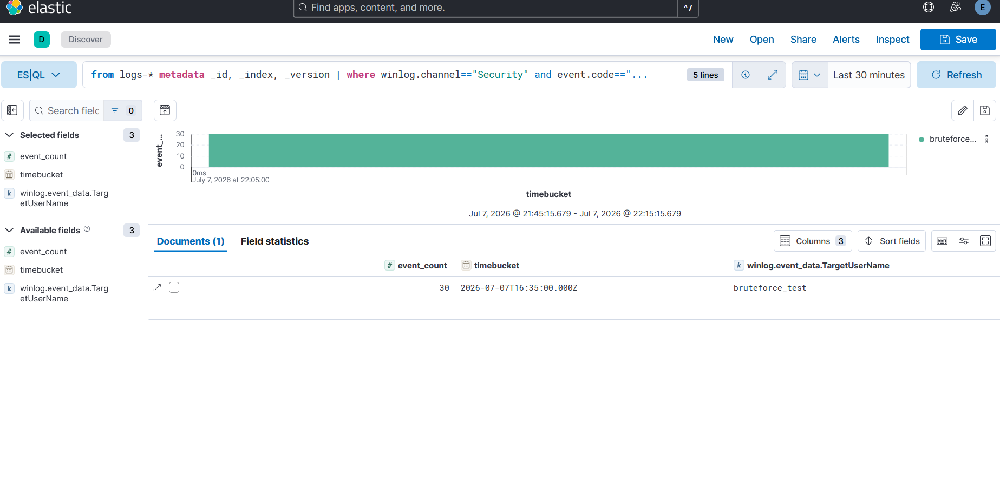

# Case Study — T1110 Failed-Logon Brute Force (Correlation)

**Rule:** [`failed-logon-bruteforce`](../../detections/credential-access/failed-logon-bruteforce/)
**Tactic / Technique:** Credential Access / T1110
**Date:** 2026-07-07

> The first **correlation-rule** validation: not "did an event match?" but "did the aggregate cross a
> threshold?" — verified by grouping and counting, not single-event matching.

## 1. Attack — a controlled failed-logon burst

Rather than an atomic (the T1110 tests need a domain/target account and risk locking a real user), a
controlled loop generates failed logons against a **fake account** — zero lockout risk, exact control:
```powershell
1..12 | ForEach-Object { cmd /c "net use \\127.0.0.1\C$ /user:bruteforce_test WrongPass$_" 2>$null }
```
Each attempt = a failed network logon → **Event ID 4625** (`TargetUserName = bruteforce_test`).

**Observability note:** 12 attempts produced **30** 4625 events — SMB performs 2–3 auth round-trips per
connection, so each attempt logs multiple failures. Real brute-force tooling is noisier still.

## 2. Detect — the correlation-verify method

Rule 4 is a Sigma **correlation** (`event_count` ≥ 10 for one account within 5 minutes). You cannot
verify it by pasting one query and finding a match — you must **aggregate over time**.

**Quick sanity (KQL):** confirm the burst landed:
```
event.code : "4625" and winlog.event_data.TargetUserName : "bruteforce_test"   -> ~30 docs
```

**The real correlation (ES|QL):** run the aggregation the rule encodes:
```esql
from logs-* metadata _id, _index, _version | where winlog.channel=="Security" and event.code=="4625"
| eval timebucket=date_trunc(5minutes, @timestamp) | stats event_count=count() by timebucket, winlog.event_data.TargetUserName
| where event_count >= 10
```
**Result: one row — `bruteforce_test`, `event_count = 30`.** That row *is* the detection firing: the
group crossed the threshold. Clean catch, no tuning.

## 3. Cross-SIEM note — correlations don't port uniformly

A key portability lesson (found when authoring the rule): threshold correlations compile differently
per backend.

| Backend | Correlation support |
|---------|---------------------|
| **Splunk** (SPL) | ✅ native (`bin` + `stats` + `search`) |
| **Elastic** | ✅ via **ES\|QL** (`stats ... | where`); ❌ **Lucene/EQL cannot aggregate** |
| **Sentinel** (Kusto) | pySigma backend has no correlation support → **KQL hand-authored** (`summarize count() ... | where`) |

So for aggregation detections: use ES|QL on Elastic (not Lucene), and expect to hand-write the Sentinel
KQL. Single-event rules don't have this constraint.

## 4. Single-event vs correlation — the mental model

| | Single-event rule | Correlation rule |
|---|---|---|
| Question | "did this bad thing happen?" | "did it happen **enough** to matter?" |
| Verify by | matching one event | grouping + counting over a window |
| Elastic query | Lucene | ES\|QL |

## Screenshots
Kibana **ES|QL** result — `bruteforce_test` with `event_count = 30` in one 5-minute bucket, over the
≥10 threshold (the correlation firing).


