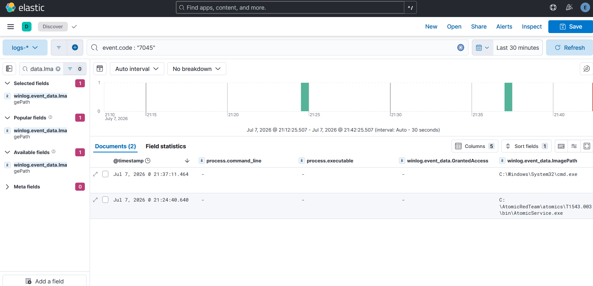

# Case Study — T1543.003 New Service Installation

**Rule:** [`new-service-install`](../../detections/persistence/new-service-install/)
**Tactic / Technique:** Persistence + Privilege Escalation / T1543.003
**Date:** 2026-07-07

> A "scope" finding: the rule behaves *exactly as designed* — it catches the high-signal case and
> deliberately skips the low-signal one. The interesting part is understanding the tradeoff, not
> fixing a bug.

## 1. Attack (Atomic Red Team)

```powershell
Invoke-AtomicTest T1543.003 -TestNumbers 2   # Service Installation CMD
```
Creates and starts a new Windows service via `sc.exe create` → fires **Event ID 7045**
("a service was installed") in the **System** log. The default test installs a service whose
binary is a downloaded executable:
```
sc.exe create AtomicTestService_CMD binPath= "C:\AtomicRedTeam\atomics\T1543.003\bin\AtomicService.exe" ...
```

## 2. Detect (default) — MISS, and why

Rule 5's query returned **nothing**. Diagnosing the miss (telemetry vs. logic):

```
event.code : "7045"   ->  1 event; winlog.event_data.ImagePath = ...\AtomicService.exe
```

- **The 7045 event landed** → telemetry is fine (System log is collected by default; no sensor gap
  like T1003.001's EID 10).
- **The `ImagePath` is `AtomicService.exe`** — a binary that matches **none** of Rule 5's patterns
  (`cmd`, `powershell`, `\Temp\`, `\AppData\`, `PSEXESVC`, `.bat`, `.vbs`…).

So this is a **rule-scope miss, not a bug.** Rule 5 is deliberately narrow — it flags services whose
image is a **shell/script or a temp/user path** (Cobalt Strike `cmd /c ...`, PsExec `PSEXESVC`) — and
intentionally does **not** flag every service install, because legitimate software installs services
with their own `.exe` constantly (alerting on all of them = noise flood).

## 3. Validate the intended scope — CATCH

Forced a shell-based service (the pattern Rule 5 *is* built for), with a fresh name:
```powershell
Invoke-AtomicTest T1543.003 -TestNumbers 2 -InputArgs @{"binary_path"="C:\Windows\System32\cmd.exe"; "service_name"="AtomicSvc_Shell"}
```
(`CreateService SUCCESS`; the `StartService` error 1053 is expected — `cmd.exe` isn't a real service,
but the 7045 creation event already fired.)

Re-hunting `event.code : "7045"` and pasting Rule 5's Lucene query:

| Service | ImagePath | Rule 5 |
|---------|-----------|--------|
| `AtomicTestService_CMD` | `...\AtomicService.exe` (arbitrary binary) | ❌ **miss** (scope) |
| `AtomicSvc_Shell` | `C:\Windows\System32\cmd.exe` (shell) | ✅ **catch** |

The rule fires on the shell-based service and skips the binary one — working exactly as scoped.

## 4. The coverage tradeoff & recommendation

The **cost** of Rule 5's precision: a malware service running its **own binary** from a normal path
(this test, TinyTurla, much real-world service persistence) evades it. You do **not** fix this by
widening Rule 5 — that reintroduces the noise it was designed to avoid.

The mature answer is **two-tier coverage**:
- **Rule 5 (high fidelity, `level: high`)** — shell/temp/PsExec service images → auto-alert.
- **A complementary low-severity rule (`level: informational`/`low`)** — *any* new service (7045) as a
  hunting/review feed, since service installs are rare enough to review. This catches the
  binary-based services Rule 5 intentionally skips.

*(Building that companion rule is a nice follow-up — "found a coverage gap, closed it with a
two-tier design.")*

## Screenshots

`event.code : "7045"` in Discover — both services side by side: `AtomicSvc_Shell` with
ImagePath `cmd.exe` (matched by Rule 5) and `AtomicTestService_CMD` with ImagePath `AtomicService.exe`
(skipped by scope).


